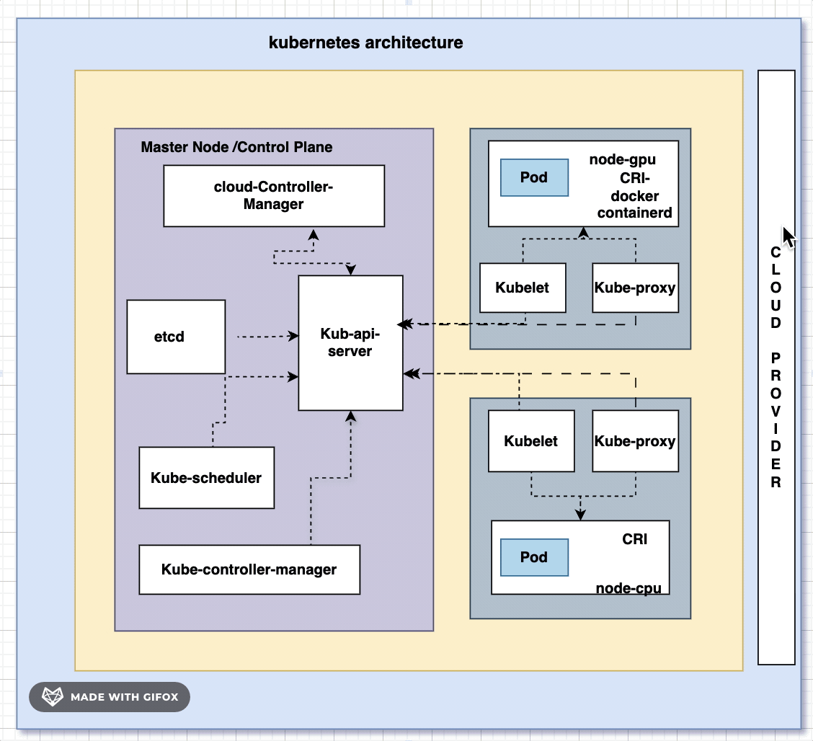
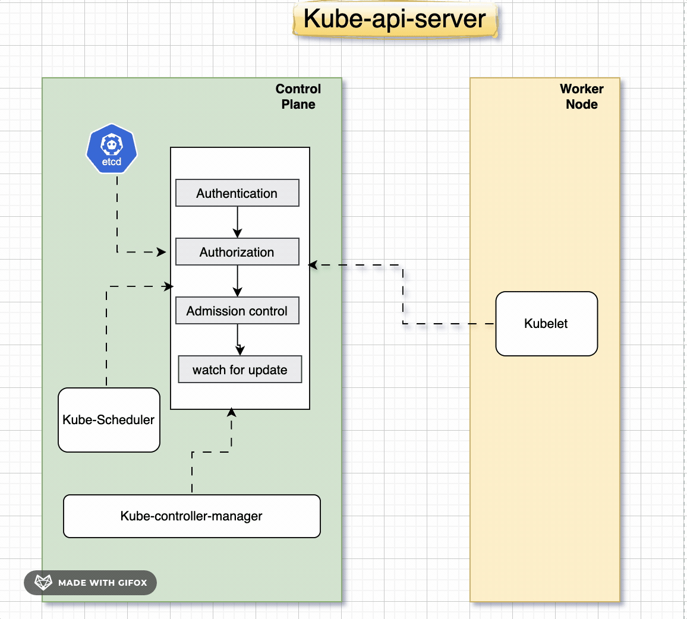
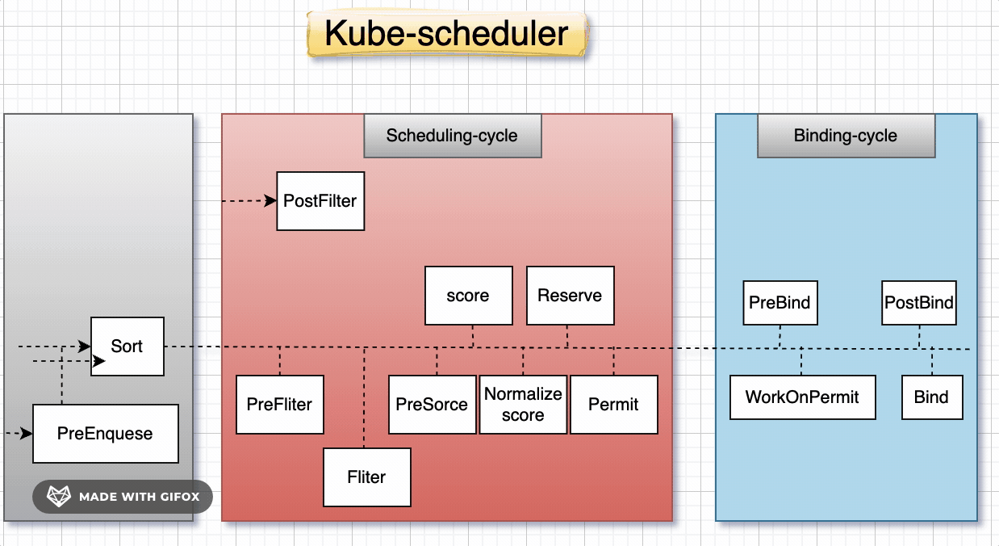
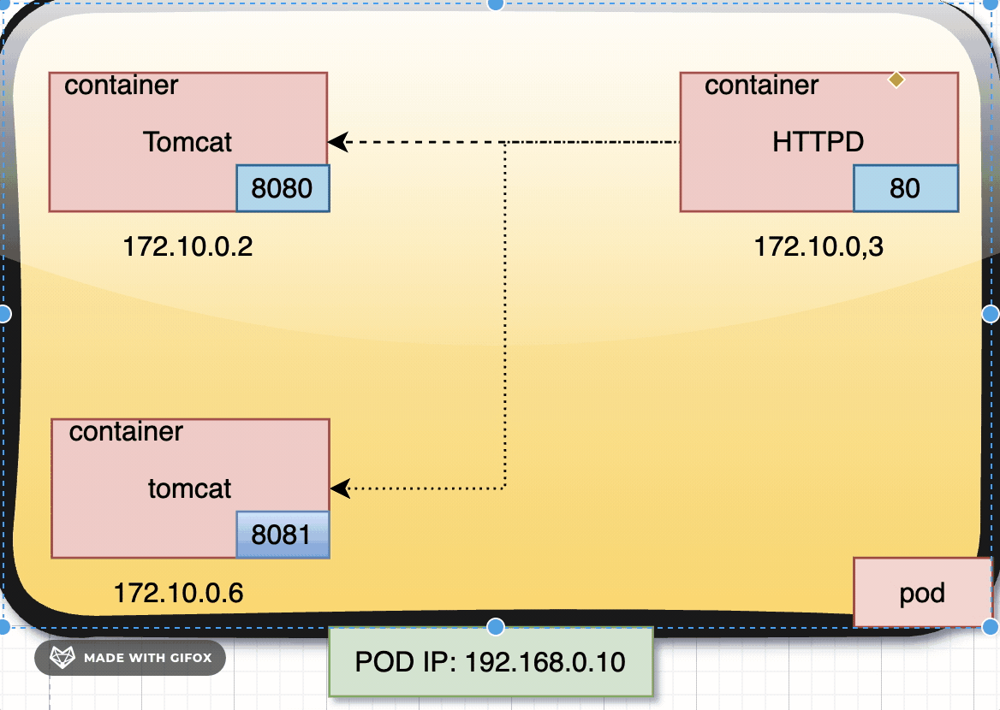

# Orchestration Tool: Kubernetes


## Introduction to Kubernetes
Kubernetes, often referred to as K8s, is an open-source platform designed to automate the deployment, scaling, and management of containerized applications. Initially developed by Google, Kubernetes is now maintained by the Cloud Native Computing Foundation (CNCF). It has become the industry standard for container orchestration.

## Why Do We Need an Orchestration Tool?
With the rise of containerized applications, managing containers in production environments has become increasingly complex. Challenges include:
- **Scalability**: Managing hundreds or thousands of containers.
- **Load Balancing**: Ensuring even distribution of traffic across containers.
- **High Availability**: Preventing downtime by managing container failures automatically.
- **Resource Optimization**: Efficiently utilizing system resources like CPU and memory.
- **Service Discovery**: Making it easy for containers to communicate with each other.
- **Automation**: Reducing manual intervention for repetitive tasks like deployment and scaling.

Container orchestration tools like Kubernetes address these challenges by automating the deployment, scaling, and operation of containers, making them essential in modern DevOps workflows.

## Why Kubernetes?
Kubernetes has emerged as the preferred orchestration tool for several reasons:
1. **Open Source**: Vendor-neutral and community-driven.
2. **Scalability**: Designed to handle large-scale workloads.
3. **Portability**: Works across on-premises, cloud, and hybrid environments.
4. **Extensibility**: Highly customizable through APIs and plugins.
5. **Resilience**: Automatic healing of failed containers and rescheduling.
6. **Comprehensive Ecosystem**: Supported by a wide range of tools and platforms.

## Architecture of Kubernetes
Kubernetes employs a master-worker architecture:



# Kubernetes Architecture: Simplified Explanation for Students

Kubernetes is a powerful system for managing containerized applications. To understand how it works, let's break down its architecture into simple terms. Think of Kubernetes as a team of workers and managers who ensure your applications run smoothly.

---

## **1. Master Node: The "Manager" of the Cluster**

The **Master Node** is like the boss of the Kubernetes cluster. It makes all the important decisions and ensures everything runs as expected. Here are its key components:

### **a. API Server**
- **Role**: The "front desk" of the cluster.
- **What it does**: Handles all communication between users (like you) and the cluster. When you run commands (e.g., `kubectl`), the API Server listens and responds.

### **b. Controller Manager**
- **Role**: The "supervisor" of the cluster.
- **What it does**: Makes sure the cluster is in the desired state. For example, if you want 5 copies of an app running, the Controller Manager ensures exactly 5 are running.

### **c. Scheduler**
- **Role**: The "assigner" of tasks.
- **What it does**: Decides which worker node should run a specific task (e.g., a Pod). It looks at resource availability and assigns tasks accordingly.

### **d. etcd**
- **Role**: The "memory" of the cluster.
- **What it does**: Stores all the important information about the cluster (e.g., what's running, where it's running). Think of it as a notebook where the Master Node writes everything down.

---

## **2. Worker Node: The "Worker" of the Cluster**

The **Worker Node** is where the actual work happens. It runs your applications and ensures they are up and running. Here are its key components:

### **a. Kubelet**
- **Role**: The "foreman" of the worker node.
- **What it does**: Communicates with the Master Node and ensures containers are running as expected. It also reports back to the Master Node about the node's health.

### **b. Kube-proxy**
- **Role**: The "traffic cop" of the worker node.
- **What it does**: Handles networking and ensures requests are routed correctly to the containers. It makes sure your app can talk to other apps or the outside world.

### **c. Container Runtime**
- **Role**: The "engine" of the worker node.
- **What it does**: Runs the containers (e.g., Docker, containerd). It pulls the container images and starts/stops containers as needed.

---

## **3. Pods: The "Workers" of Your Applications**

A **Pod** is the smallest unit in Kubernetes. Think of it as a "worker" that runs your application. Here’s what you need to know:

- **What it does**: A Pod can run one or more containers. These containers share the same storage and network.
- **Example**: If your app has a web server and a database, they can run in the same Pod and talk to each other easily.

---

## **4. Additional Components: The "Helpers" of the Cluster**

Kubernetes has some extra components that make life easier:

### **a. ConfigMaps and Secrets**
- **Role**: The "notebook" for settings and secrets.
- **What it does**: Stores configuration data (e.g., environment variables) and sensitive information (e.g., passwords) for your apps.

### **b. Ingress**
- **Role**: The "gatekeeper" for HTTP/HTTPS traffic.
- **What it does**: Manages external access to your apps. For example, it routes traffic from `example.com` to the correct app.

### **c. Namespaces**
- **Role**: The "dividers" of the cluster.
- **What it does**: Isolates resources within the cluster. For example, you can have separate namespaces for development, testing, and production.

---

## **Lifecycle of a Pod: The "Journey" of Your Application**

A Pod goes through different stages in its lifecycle. Here’s what happens:

1. **Pending**: The Pod is accepted by the cluster but is waiting for resources (e.g., CPU, memory) to be assigned.
2. **Running**: The Pod has been assigned to a worker node, and its containers are running.
3. **Succeeded**: All containers in the Pod have completed their tasks successfully.
4. **Failed**: One or more containers in the Pod have stopped with an error.
5. **Unknown**: The cluster can't determine the Pod's state (e.g., due to a communication issue).

---

## **Kubernetes Architecture in a Nutshell**

- **Master Node**: The "manager" that makes decisions and keeps the cluster running.
- **Worker Node**: The "worker" that runs your applications.
- **Pods**: The "workers" of your apps, running one or more containers.
- **Additional Components**: Helpers like ConfigMaps, Secrets, Ingress, and Namespaces that make managing apps easier.

---

## **Example Workflow**

1. You tell Kubernetes to run an app using `kubectl`.
2. The **API Server** receives your request and forwards it to the **Scheduler**.
3. The **Scheduler** assigns the app to a **Worker Node**.
4. The **Kubelet** on the Worker Node starts the app in a **Pod**.
5. The **Controller Manager** ensures the app stays running, and **etcd** stores all the details.
6. If the app needs to talk to other apps, **Kube-proxy** handles the networking.

---

## **How to Explain Kubernetes Architecture to an Interviewer**

When explaining Kubernetes architecture in an interview, follow these steps to make your explanation clear and concise:

### **1. Start with the Big Picture**
- Say: "Kubernetes is like a team of managers and workers that ensure your applications run smoothly. It has two main types of nodes: the **Master Node** (the manager) and the **Worker Node** (the worker)."

### **2. Break Down the Master Node**
- Say: "The **Master Node** is the brain of the cluster. It has four key components:
  - **API Server**: Handles all communication.
  - **Controller Manager**: Ensures the cluster is in the desired state.
  - **Scheduler**: Assigns tasks to worker nodes.
  - **etcd**: Stores all cluster data."

### **3. Explain the Worker Node**
- Say: "The **Worker Node** is where the actual work happens. It has three key components:
  - **Kubelet**: Manages containers and reports to the Master Node.
  - **Kube-proxy**: Handles networking.
  - **Container Runtime**: Runs the containers (e.g., Docker)."

### **4. Describe Pods**
- Say: "A **Pod** is the smallest unit in Kubernetes. It runs one or more containers and provides shared storage and networking for them."

### **5. Mention Additional Components**
- Say: "Kubernetes also has helpers like **ConfigMaps** and **Secrets** for configuration, **Ingress** for routing traffic, and **Namespaces** for isolating resources."

### **6. Summarize the Workflow**
- Say: "When you deploy an app, the **API Server** receives your request, the **Scheduler** assigns it to a **Worker Node**, and the **Kubelet** starts the app in a **Pod**. The **Controller Manager** ensures everything runs as expected, and **etcd** stores all the details."

### **7. Use an Example**
- Say: "For example, if you deploy a web app, Kubernetes ensures it runs on the right node, scales it when needed, and routes traffic to it using **Ingress**."

### **8. Keep It Simple**
- Avoid diving too deep into technical jargon unless asked. Focus on the high-level concepts and how they work together.

---

This simplified explanation of Kubernetes architecture is designed to help students understand the key components and how they work together to manage containerized applications. It also provides a clear guide on how to explain Kubernetes architecture to an interviewer in a structured and confident manner.




# Kubernetes API Server: In-Depth Explanation

The Kubernetes API Server is the central management entity in a Kubernetes cluster. It acts as the gateway for all communication between components, such as the `kubectl` CLI, worker nodes, controllers, and other cluster services. The API Server is responsible for validating, processing, and storing cluster state changes in the etcd database. Below is a detailed explanation of its key components and functionalities.

---

## **1. Authentication**

### **Purpose:**
- Verifies the identity of users, services, or applications making requests to the API Server.

### **Mechanisms:**
- **X.509 Client Certificates**: Clients present a certificate signed by the cluster's Certificate Authority (CA).
- **Bearer Tokens**: Static tokens or service account tokens are used for authentication.
- **OpenID Connect (OIDC)**: Integrates with external identity providers (e.g., Google, Azure AD).
- **Webhook Token Authentication**: Delegates token validation to an external service.
- **Authenticating Proxy**: Relies on a proxy to authenticate requests.

### **Workflow:**
1. A client sends a request to the API Server with credentials (e.g., certificate, token).
2. The API Server validates the credentials against the configured authentication mechanisms.
3. If valid, the request proceeds to the next stage (authorization). If invalid, the request is rejected.

---

## **2. Authorization**

### **Purpose:**
- Determines whether an authenticated user or service has permission to perform the requested action.

### **Mechanisms:**
- **Role-Based Access Control (RBAC)**: Defines roles and role bindings to grant permissions.
- **Attribute-Based Access Control (ABAC)**: Uses policies based on user attributes (e.g., group, namespace).
- **Node Authorization**: Grants permissions to kubelets based on their node identity.
- **Webhook Authorization**: Delegates authorization decisions to an external service.

### **Workflow:**
1. After authentication, the API Server checks the request against the configured authorization policies.
2. If the user has the required permissions, the request proceeds. If not, the request is denied.

---

## **3. Admission Controllers**

### **Purpose:**
- Enforces custom policies and validates or mutates requests before they are persisted to etcd.

### **Types:**
- **Validating Admission Controllers**: Validate requests (e.g., `PodSecurityPolicy`, `ResourceQuota`).
- **Mutating Admission Controllers**: Modify requests (e.g., `DefaultStorageClass`, `PodNodeSelector`).

### **Common Admission Controllers:**
- **NamespaceLifecycle**: Ensures resources are not created in non-existent or terminating namespaces.
- **LimitRanger**: Enforces resource limits and defaults.
- **PodSecurity**: Applies security policies to Pods.
- **ResourceQuota**: Enforces resource quotas for namespaces.

### **Workflow:**
1. After authentication and authorization, the request is passed to the admission controllers.
2. Validating controllers check the request for compliance with policies.
3. Mutating controllers modify the request if necessary.
4. If all checks pass, the request is persisted to etcd.

---

## **4. Watch Mechanism**

### **Purpose:**
- Enables clients to watch for changes to resources in real-time.

### **How It Works:**
1. A client sends a `watch` request to the API Server for a specific resource (e.g., Pods, Deployments).
2. The API Server opens a long-lived HTTP connection and streams updates to the client.
3. When a change occurs (e.g., a Pod is created, updated, or deleted), the API Server sends a notification to the client.

### **Use Cases:**
- **Controllers**: Watch for changes to resources and reconcile the desired state.
- **kubectl**: Provides real-time updates when using commands like `kubectl get pods --watch`.

### **Advantages:**
- Efficient: Reduces the need for frequent polling.
- Real-time: Clients receive updates immediately.

---

## **API Server Workflow Summary**

1. **Authentication**: Verify the identity of the client.
2. **Authorization**: Check if the client has permission to perform the requested action.
3. **Admission Control**: Validate or mutate the request.
4. **Persist to etcd**: Store the validated request in the cluster's database.
5. **Watch for Updates**: Stream real-time updates to clients.

---

## **Key Notes**
- The API Server is stateless and scalable, with all cluster state stored in etcd.
- It acts as the single source of truth for the cluster's desired state.
- Authentication, authorization, and admission controllers ensure security and policy enforcement.
- The watch mechanism enables real-time updates, which are critical for controllers and clients.

---

## **Example Workflow**
1. A user runs `kubectl create -f pod.yaml` to create a Pod.
2. The request is sent to the API Server.
3. The API Server authenticates the user using their kubeconfig credentials.
4. The API Server authorizes the request based on the user's RBAC roles.
5. Admission controllers validate the Pod's configuration and apply defaults if necessary.
6. The Pod definition is stored in etcd.
7. The scheduler watches for new Pods and assigns them to a Node.
8. The kubelet on the assigned Node watches for changes and creates the Pod.

---




# **Kubernetes Scheduler: In-Depth Explanation of Scheduling and Binding Cycles**

The Kubernetes Scheduler is a critical component of the Kubernetes control plane. It is responsible for assigning Pods to Nodes in a cluster based on resource requirements, constraints, and policies. The scheduling process is divided into two main cycles: the **Scheduling Cycle** and the **Binding Cycle**. Each cycle consists of multiple phases that ensure Pods are scheduled and bound to Nodes efficiently and correctly.

---

## **1. Scheduling Cycle**

The Scheduling Cycle is responsible for selecting a suitable Node for a Pod. It consists of the following phases:

### **1.1 Sort**
- **Purpose**: Orders the list of pending Pods based on their priority and other factors.
- **Details**: The scheduler uses a priority queue to sort Pods. Higher-priority Pods are scheduled first.

### **1.2 PreEnqueue**
- **Purpose**: Filters out Pods that cannot be scheduled due to specific conditions (e.g., Pods with unmet dependencies).
- **Details**: This phase ensures that only schedulable Pods enter the scheduling queue.

### **1.3 PreFilter**
- **Purpose**: Performs initial checks on the Pod and the cluster state.
- **Details**: This phase ensures that the Pod meets basic requirements (e.g., resource requests, node selectors) before proceeding to filtering.

### **1.4 Filter**
- **Purpose**: Filters out Nodes that do not meet the Pod's requirements.
- **Details**: The scheduler evaluates each Node against the Pod's constraints (e.g., resource availability, taints, tolerations, affinity/anti-affinity rules). Nodes that fail these checks are excluded.

### **1.5 PreScore**
- **Purpose**: Prepares data for the scoring phase.
- **Details**: This phase calculates intermediate values or metrics that will be used during the scoring phase.

### **1.6 Normalize**
- **Purpose**: Normalizes scores to ensure consistency across different scoring plugins.
- **Details**: Scores from different plugins are adjusted to a common scale, ensuring fairness in the final decision.

### **1.7 Permit**
- **Purpose**: Determines whether the Pod can proceed to binding.
- **Details**: This phase can delay scheduling (e.g., for Pods waiting on external dependencies) or reject the Pod entirely.

### **1.8 Score**
- **Purpose**: Ranks the remaining Nodes based on their suitability for the Pod.
- **Details**: Each Node is assigned a score based on factors like resource availability, affinity rules, and other policies. The Node with the highest score is selected.

### **1.9 Reserve**
- **Purpose**: Reserves resources on the selected Node for the Pod.
- **Details**: This phase ensures that the Node's resources are allocated to the Pod, preventing other Pods from using them.

### **1.10 PostFilter**
- **Purpose**: Handles cases where no suitable Node is found for the Pod.
- **Details**: If no Node passes the filtering phase, this phase can trigger actions like preemption (evicting lower-priority Pods to free up resources).

---

## **2. Binding Cycle**

Once a Node is selected in the Scheduling Cycle, the Binding Cycle is responsible for binding the Pod to the Node. It consists of the following phases:

### **2.1 PreBind**
- **Purpose**: Performs actions before binding the Pod to the Node.
- **Details**: This phase can include tasks like mounting volumes or setting up network configurations.

### **2.2 Bind**
- **Purpose**: Binds the Pod to the selected Node.
- **Details**: The scheduler updates the Kubernetes API server with the Pod's Node assignment.

### **2.3 PostBind**
- **Purpose**: Performs cleanup or notification tasks after binding.
- **Details**: This phase can include logging, metrics collection, or notifying external systems.

### **2.4 Work on Permit**
- **Purpose**: Handles Pods that were delayed in the Permit phase.
- **Details**: If a Pod was delayed (e.g., waiting for external dependencies), this phase ensures it is eventually scheduled.

---

## **Summary of Scheduling and Binding Cycles**

### **Scheduling Cycle Phases:**
1. **Sort**: Orders pending Pods.
2. **PreEnqueue**: Filters out unschedulable Pods.
3. **PreFilter**: Performs initial checks.
4. **Filter**: Filters out unsuitable Nodes.
5. **PreScore**: Prepares data for scoring.
6. **Normalize**: Normalizes scores.
7. **Permit**: Determines if the Pod can proceed.
8. **Score**: Ranks Nodes.
9. **Reserve**: Reserves resources on the selected Node.
10. **PostFilter**: Handles cases where no Node is found.

### **Binding Cycle Phases:**
1. **PreBind**: Performs pre-binding tasks.
2. **Bind**: Binds the Pod to the Node.
3. **PostBind**: Performs post-binding tasks.
4. **Work on Permit**: Handles delayed Pods.

---

## **Key Notes**
- The **Scheduling Cycle** is responsible for selecting a Node, while the **Binding Cycle** ensures the Pod is bound to the Node.
- Each phase in the Scheduling Cycle plays a critical role in ensuring efficient and fair scheduling.
- The Binding Cycle handles tasks that occur after a Node is selected, such as resource allocation and cleanup.
- Kubernetes allows customization of the scheduling process through **scheduler plugins**, which can extend or modify the behavior of each phase.   

---

## Cluster Creation Methods
### 1. **Minikube**
- Ideal for local development and testing.
- Creates a single-node Kubernetes cluster on a local machine.

### 2. **Kind (Kubernetes in Docker)**
- Uses Docker containers to simulate Kubernetes clusters.
- Lightweight and ideal for CI/CD pipelines.

### 3. **Kubeadm**
- A tool for creating and configuring production-grade Kubernetes clusters.
- Requires manual setup of infrastructure and networking.

### 4. **EKS (Elastic Kubernetes Service)**
- Managed Kubernetes service by AWS.
- Simplifies cluster creation and management.

### 5. **GKE (Google Kubernetes Engine)**
- Managed Kubernetes service by Google Cloud.
- Deep integration with Google’s ecosystem.

### 6. **AKS (Azure Kubernetes Service)**
- Managed Kubernetes service by Microsoft Azure.
- Integrated with Azure’s monitoring and identity solutions.


---
# Kubernetes: Cluster Creation and Management

## Create a Cluster Using EKS
Amazon Elastic Kubernetes Service (EKS) simplifies the process of running Kubernetes on AWS. Below is a step-by-step guide:

1. **Prerequisites**:
   - AWS CLI installed and configured with proper IAM permissions.
   - `eksctl` installed for cluster creation.
   - `kubectl` installed for managing the cluster.

2. **Cluster Creation**:
   ```bash
   eksctl create cluster \
     --name my-cluster \
     --region us-west-2 \
     --nodegroup-name my-nodes \
     --node-type t3.medium \
     --nodes 2 \
     --nodes-min 1 \
     --nodes-max 3 \
     --managed
   ```
   - `--name`: Specifies the cluster name.
   - `--node-type`: Defines the instance type for nodes.
   - `--managed`: Indicates that AWS manages the node group.

3. **Verification**:
   - Confirm the cluster is running:
     ```bash
     eksctl get cluster
     ```

---

# Create Amazon EKS Cluster Using CLI

This guide provides step-by-step instructions for setting up and managing an Amazon EKS cluster using the CLI. We will cover the installation of necessary tools and the creation of an EKS cluster.

---

## Step 1: Install `eksctl`

`eksctl` is a simple CLI tool for creating and managing Kubernetes clusters on Amazon EKS.

```bash
curl --silent --location "https://github.com/weaveworks/eksctl/releases/latest/download/eksctl_$(uname -s)_amd64.tar.gz" | tar xz -C /tmp
sudo mv /tmp/eksctl /usr/local/bin

# Verify installation
eksctl version
```

---

## Step 2: Install `kubectl`

`kubectl` is the Kubernetes command-line tool used to interact with Kubernetes clusters.

### Download and Verify `kubectl`

```bash
curl -LO "https://dl.k8s.io/release/$(curl -L -s https://dl.k8s.io/release/stable.txt)/bin/linux/amd64/kubectl"
curl -LO "https://dl.k8s.io/release/$(curl -L -s https://dl.k8s.io/release/stable.txt)/bin/linux/amd64/kubectl.sha256"

echo "$(cat kubectl.sha256)  kubectl" | sha256sum --check
```

### Install `kubectl`

```bash
sudo install -o root -g root -m 0755 kubectl /usr/local/bin/kubectl

# Alternatively, install in local directory
chmod +x kubectl
mkdir -p ~/.local/bin
mv ./kubectl ~/.local/bin/kubectl

# Verify installation
kubectl version --client
```

---

## Step 3: Install AWS CLI

The AWS Command Line Interface (CLI) is used to manage AWS services from the command line.

### Download and Install AWS CLI

```bash
sudo apt install unzip -y
curl "https://awscli.amazonaws.com/awscli-exe-linux-x86_64.zip" -o "awscliv2.zip"
unzip awscliv2.zip
sudo ./aws/install
```

### Configure AWS CLI

```bash
aws configure
```
You will be prompted to enter your AWS access key, secret key, region, and output format.

---

## Step 4: Create an EKS Cluster

Use `eksctl` to create an Amazon EKS cluster with the desired configuration.

### Create Cluster Command

```bash
eksctl create cluster \
  --name demo-ekscluster \
  --region ap-south-1 \
  --version 1.27 \
  --nodegroup-name linux-nodes \
  --node-type t2.micro \
  --nodes 2
```
- **`--name`**: Specifies the name of the cluster.
- **`--region`**: AWS region where the cluster will be created.
- **`--version`**: Kubernetes version.
- **`--nodegroup-name`**: Name of the node group.
- **`--node-type`**: Instance type for the nodes.
- **`--nodes`**: Number of nodes in the cluster.

---

## Step 5: Update `kubeconfig`

Once the cluster is created, update the `kubeconfig` file to interact with the cluster.

```bash
aws eks update-kubeconfig --name demo-ekscluster
```

---

## Step 6: Delete the EKS Cluster

If the cluster is no longer needed, it can be deleted using the following command:

```bash
eksctl delete cluster --name demo-ekscluster --region us-east-1
```

---

## Introduction to Pods and Services

### Pods
A Pod is the smallest deployable unit in Kubernetes, encapsulating one or more containers with shared resources like storage and network.

- **Lifecycle**:
  - Pending → Running → Succeeded/Failed → Terminated

- **Use Cases**:
  - Running a single application container.
  - Running multiple containers that share resources and are tightly coupled (e.g., sidecar patterns).

### Services
Services provide stable networking and expose Pods to other applications or external traffic.

- **Types of Services**:
  1. **ClusterIP**: Exposes the service within the cluster.
  2. **NodePort**: Exposes the service on each node’s IP at a static port.
  3. **LoadBalancer**: Exposes the service to the internet using a cloud provider’s load balancer.

---

## Main Container and Sidecar Containers

### Main Container
The primary container that serves the main purpose of the application. Examples include application servers or web servers.

### Sidecar Container
An auxiliary container that provides supporting functionalities, such as logging, monitoring, or proxying.

- **Examples**:
  - A logging container (e.g., Fluentd) that collects logs from the main container.
  - A proxy container (e.g., Envoy) that manages network traffic.

- **Benefits**:
  - Decouples concerns and improves maintainability.
  - Allows independent scaling and updates.

- **Implementation** (Sample Pod with a Sidecar):
  ```yaml
  apiVersion: v1
  kind: Pod
  metadata:
    name: example-pod
  spec:
    containers:
    - name: main-app
      image: nginx
    - name: sidecar-logging
      image: fluentd
  ```

---

## Run First Pod Using kubectl

1. **Create a Pod**:
   ```bash
   kubectl run nginx-pod --image=nginx --restart=Never
   ```
   - `--image`: Specifies the container image.
   - `--restart=Never`: Ensures the creation of a standalone Pod.

2. **Verify Pod**:
   ```bash
   kubectl get pods
   ```

3. **View Pod Details**:
   ```bash
   kubectl describe pod nginx-pod
   ```

---

## Expose Pod Using kubectl expose

1. **Expose Pod**:
   ```bash
   kubectl expose pod nginx-pod --type=NodePort --port=80
   ```
   - `--type=NodePort`: Exposes the Pod on a static port.
   - `--port`: Specifies the port the Pod listens on.

2. **Get Service Details**:
   ```bash
   kubectl get svc
   ```

3. **Access the Pod**:
   - Use the `<NodeIP>:<NodePort>` to access the exposed Pod.

---

## In-Depth: kubectl Usage

### Common Commands
- **View Resources**:
  ```bash
  kubectl get pods
  kubectl get svc
  kubectl get nodes
  ```

- **Apply Changes**:
  ```bash
  kubectl apply -f <manifest-file>.yaml
  ```

- **Delete Resources**:
  ```bash
  kubectl delete pod <pod-name>
  ```

- **Debugging**:
  ```bash
  kubectl logs <pod-name>
  kubectl exec -it <pod-name> -- /bin/bash
  ```

### Resource Management
- Scaling Deployments:
  ```bash
  kubectl scale deployment <deployment-name> --replicas=3
  ```

- Viewing Pod Events:
  ```bash
  kubectl describe pod <pod-name>
  ```

---

## Pod Management

### Key Operations
1. **Creating Pods**:
   Using YAML manifests to define desired state.
2. **Deleting Pods**:
   Graceful termination using `kubectl delete pod <pod-name>`.
3. **Monitoring Pods**:
   - `kubectl top pod` for resource usage.
   - `kubectl get pod -o wide` for detailed status.

---

## Conclusion
This guide provides a comprehensive understanding of EKS cluster creation, kubectl usage, and managing Pods, including advanced topics like sidecar containers. Mastery of these concepts is crucial for orchestrating containerized workloads effectively.

----

# Amazon EKS IAM Roles Guide

## Amazon EKS Cluster IAM Role

### Creating the Amazon EKS Cluster Role

#### Using the AWS Management Console

1. Open the IAM console at [IAM Console](https://console.aws.amazon.com/iam/).
2. In the left navigation pane, choose **Roles**, then select **Create role**.
3. Under **Trusted entity type**, select **AWS service**.
4. From the **Use cases for other AWS services** dropdown list, choose **EKS**.
5. Choose **EKS - Cluster** for your use case, and then select **Next**.
6. On the **Add permissions** tab, click **Next**.
7. For **Role name**, enter a unique name for your role, such as `eksClusterRole`.
8. For **Description**, enter descriptive text such as `Amazon EKS - Cluster role`.
9. Choose **Create role**.

---

## Amazon EKS Node IAM Role

### Creating the Amazon EKS Node IAM Role

#### Using the AWS Management Console

1. Open the IAM console at [IAM Console](https://console.aws.amazon.com/iam/).
2. In the left navigation pane, select **Roles**.
3. On the **Roles** page, choose **Create role**.
4. On the **Select trusted entity** page, do the following:
   - In the **Trusted entity type** section, choose **AWS service**.
   - Under **Use case**, choose **EC2**.
   - Click **Next**.
5. On the **Add permissions** page, do the following:
   - In the **Filter policies** box, enter `AmazonEKSWorkerNodePolicy`.
   - Select the checkbox to the left of **AmazonEKSWorkerNodePolicy** in the search results.
   - Choose **Clear filters**.
   - In the **Filter policies** box, enter `AmazonEC2ContainerRegistryPullOnly`.
   - Select the checkbox to the left of **AmazonEC2ContainerRegistryPullOnly** in the search results.
   - Optionally, attach either the **AmazonEKS_CNI_Policy** managed policy or an IPv6 policy you create. We recommend assigning this policy to the role associated with the Kubernetes service account instead of this role. For more information, see [Configure Amazon VPC CNI plugin to use IRSA](https://docs.aws.amazon.com/eks/latest/userguide/cni-iam-role.html).
6. Choose **Next**.
7. On the **Name, review, and create** page, do the following:
   - For **Role name**, enter a unique name for your role, such as `AmazonEKSNodeRole`.
   - For **Description**, enter descriptive text such as `Amazon EKS - Node role`.
   - Optionally, add metadata to the role by attaching tags as key-value pairs. For more information, see [Tagging IAM resources in the IAM User Guide](https://docs.aws.amazon.com/IAM/latest/UserGuide/id_tags.html).
8. Choose **Create role**.

---

## Amazon EKS Auto Mode Cluster IAM Role

### Overview
When using Amazon EKS in **Auto Mode**, an IAM role is required to manage your EKS cluster seamlessly. Follow these steps to create and configure this role.

#### Using the AWS Management Console

1. Navigate to the IAM console at [IAM Console](https://console.aws.amazon.com/iam/).
2. Choose **Roles**, then select **Create role**.
3. Under **Trusted entity type**, select **AWS service**.
4. From the **Use cases for other AWS services** dropdown, choose **EKS**.
5. Select **EKS - Cluster** as the use case and proceed by clicking **Next**.
6. On the **Add permissions** page, attach any additional policies needed for managing your Auto Mode cluster or click **Next** if none are required.
7. On the **Name, review, and create** page, complete the following:
   - Assign a unique name, such as `eksAutoModeClusterRole`.
   - Provide a description, such as `IAM role for managing EKS Auto Mode cluster`.
8. Click **Create role**.

---

## Additional Notes
- For both **Cluster** and **Node** roles, ensure you follow AWS best practices by assigning only the necessary permissions to reduce security risks.
- Regularly audit your IAM roles and policies to ensure compliance with your organization’s security guidelines.
- For more information, refer to the [Amazon EKS User Guide](https://docs.aws.amazon.com/eks/latest/userguide/).

----

# Introduction to YAML Scripts and Kubernetes Manifest Files

## Understanding YAML Scripts
YAML (YAML Ain't Markup Language) is a human-readable data serialization format used extensively in Kubernetes for writing manifest files. It is used to define resources like Pods, Services, Deployments, and more.

### Key Features of YAML
- **Readable**: YAML is simple and easy to understand.
- **Indentation-Based**: Proper indentation is crucial.
- **Data Types**: Supports scalars (strings, numbers), lists, and dictionaries.

### Example YAML Structure
```yaml
apiVersion: v1
kind: Pod
metadata:
  name: my-pod
  labels:
    app: my-app
spec:
  containers:
    - name: my-container
      image: nginx:latest
      ports:
        - containerPort: 80
```

## Writing Manifest Files for Pods and Services
Kubernetes uses manifest files to describe the desired state of resources in the cluster. These files are written in YAML.

### Pod Manifest File
A Pod is the smallest deployable unit in Kubernetes.

```yaml
apiVersion: v1
kind: Pod
metadata:
  name: my-pod
  labels:
    app: my-app
spec:
  containers:
    - name: my-container
      image: nginx:latest
      ports:
        - containerPort: 80
```
**Explanation**:
- `apiVersion`: The API version used (e.g., v1).
- `kind`: The type of resource (e.g., Pod).
- `metadata`: Metadata such as the name and labels.
- `spec`: Specification of the Pod, including containers and their properties.

### Service Manifest File
Services expose Pods to the network and enable communication between them.

```yaml
apiVersion: v1
kind: Service
metadata:
  name: my-service
spec:
  selector:
    app: my-app
  ports:
    - protocol: TCP
      port: 80
      targetPort: 80
  type: ClusterIP
```
**Explanation**:
- `selector`: Matches the labels of the Pods to be exposed.
- `ports`: Defines the service port and the target port on the Pod.
- `type`: Specifies the service type (e.g., ClusterIP, NodePort


---
## Kubernetes Networking: Intra-Pod and Inter-Pod Communication

Kubernetes networking is fundamental for ensuring smooth communication between various components, including pods, services, and external clients. It provides flexible networking configurations for intra-pod and inter-pod communication.

### Intra-Pod Communication
- **Definition**: Intra-pod communication refers to the communication between containers within the same pod.
- **Mechanism**: Containers in a pod share the same network namespace, which means they:
  - Share the same IP address.
  - Can communicate directly using `localhost` and exposed container ports.



#### Example:
```yaml
apiVersion: v1
kind: Pod
metadata:
  name: multi-container-pod
spec:
  containers:
  - name: main-container
    image: nginx
    ports:
    - containerPort: 80
  - name: sidecar-container
    image: redis
    ports:
    - containerPort: 6379
```
In this example:
- The `main-container` and `sidecar-container` share the same IP address.
- The `main-container` can access Redis by connecting to `localhost:6379`.

### Inter-Pod Communication
- **Definition**: Inter-pod communication refers to the communication between pods.
- **Mechanism**:
  - Kubernetes assigns each pod a unique IP address.
  - Pods communicate directly using these IP addresses or via Kubernetes services.
  - Kubernetes ensures a flat network model where all pods can communicate without NAT.

#### Example:
- Pod A wants to access Pod B:
  - Pod A connects to Pod B's IP and exposed port directly.
  - Alternatively, Pod A connects via a Kubernetes service for Pod B.

### Kubernetes Service Types for Networking

#### 1. **ClusterIP**
- Default service type.
- Exposes the service only within the cluster.
- Example:
```yaml
apiVersion: v1
kind: Service
metadata:
  name: clusterip-service
spec:
  selector:
    app: backend
  ports:
  - protocol: TCP
    port: 80
    targetPort: 8080
```

#### 2. **NodePort**
- Exposes the service on a static port on each node.
- Example:
```yaml
apiVersion: v1
kind: Service
metadata:
  name: nodeport-service
spec:
  type: NodePort
  selector:
    app: backend
  ports:
  - protocol: TCP
    port: 80
    targetPort: 8080
    nodePort: 30007
```

#### 3. **LoadBalancer**
- Exposes the service externally using a cloud provider’s load balancer.
- Example:
```yaml
apiVersion: v1
kind: Service
metadata:
  name: loadbalancer-service
spec:
  type: LoadBalancer
  selector:
    app: backend
  ports:
  - protocol: TCP
    port: 80
    targetPort: 8080
```

## Key Networking Components

### 1. Pod IP
- Each pod gets a unique IP address within the cluster.
- Enables direct communication between pods without port conflicts.

### 2. Container Port
- The port exposed by the container inside the pod.
- Used for intra-pod communication.

### 3. Node IP
- IP address of the Kubernetes node.
- Used when accessing services exposed via NodePort or LoadBalancer.

### 4. Node Port
- A static port on the node that forwards traffic to the service.
- Example: Node IP + Node Port allows access to services from outside the cluster.

### 5. LoadBalancer
- Integrates with cloud provider load balancers to expose services externally.
- Automatically assigns external IPs for access.

## Examples

### Accessing a Pod Directly
```yaml
apiVersion: v1
kind: Pod
metadata:
  name: nginx-pod
spec:
  containers:
  - name: nginx
    image: nginx
    ports:
    - containerPort: 80
```
- Accessing directly via Pod IP:
  - `curl <POD_IP>:80`

### Accessing a Service via NodePort
```yaml
apiVersion: v1
kind: Service
metadata:
  name: my-nodeport-service
spec:
  type: NodePort
  selector:
    app: my-app
  ports:
  - port: 80
    targetPort: 8080
    nodePort: 30001
```
- Access:
  - `http://<NODE_IP>:30001`

### Accessing a Service via LoadBalancer
```yaml
apiVersion: v1
kind: Service
metadata:
  name: my-loadbalancer-service
spec:
  type: LoadBalancer
  selector:
    app: my-app
  ports:
  - port: 80
    targetPort: 8080
```
- Access:
  - External IP provided by the load balancer.
  - `http://<EXTERNAL_IP>:80`


  ## Namespace
Namespaces provide a way to divide cluster resources between multiple users or teams.

### Default Namespaces
- **default**: The default namespace for resources without a namespace.
- **kube-system**: For Kubernetes system resources.
- **kube-public**: For publicly accessible resources.

### Creating a Namespace
```yaml
apiVersion: v1
kind: Namespace
metadata:
  name: my-namespace
```

## ReplicationController and ReplicaSet
ReplicationControllers and ReplicaSets ensure that the specified number of Pod replicas are running at all times.

### ReplicationController
```yaml
apiVersion: v1
kind: ReplicationController
metadata:
  name: my-rc
spec:
  replicas: 3
  selector:
    app: my-app
  template:
    metadata:
      labels:
        app: my-app
    spec:
      containers:
        - name: my-container
          image: nginx:latest
```
**Explanation**:
- `replicas`: Specifies the desired number of Pods.
- `selector`: Matches labels to identify Pods.
- `template`: Describes the Pods to be created.

### ReplicaSet
```yaml
apiVersion: apps/v1
kind: ReplicaSet
metadata:
  name: my-rs
spec:
  replicas: 3
  selector:
    matchLabels:
      app: my-app
  template:
    metadata:
      labels:
        app: my-app
    spec:
      containers:
        - name: my-container
          image: nginx:latest
```
**Explanation**:
- `matchLabels`: Provides a more flexible way of selecting Pods.

### Differences Between ReplicationController and ReplicaSet
| Feature               | ReplicationController                  | ReplicaSet                          |
|-----------------------|----------------------------------------|-------------------------------------|
| **Selector**          | Uses equality-based selectors only.   | Supports set-based and equality-based selectors. |
| **Flexibility**       | Limited in matching Pods.             | More flexible in selecting Pods based on labels. |
| **Usage**             | Older method, being phased out.       | Preferred in modern deployments.   |

----


# Deployments vs StatefulSets, Writing Manifests, and Understanding DaemonSets

## Introduction
In Kubernetes, different controllers manage specific workloads depending on the requirements of applications. Among the most commonly used are Deployments, StatefulSets, and DaemonSets. Each serves unique purposes in orchestrating containerized applications.

---

## Deployments vs StatefulSets

### Deployments
A **Deployment** ensures a specified number of pod replicas are running at any given time. Deployments are best suited for stateless applications.

#### Features of Deployments
- Stateless nature, meaning all pods are interchangeable.
- Easy scaling and updates with zero downtime.
- Fast rollback capability.
- Pods are recreated with new identities upon termination.

#### Use Cases
- Web servers.
- APIs.
- Microservices with no data dependency.

### StatefulSets
A **StatefulSet** is used for applications requiring unique identities and persistent storage for each pod. These are suited for stateful applications.

#### Features of StatefulSets
- Maintains a stable identity for each pod.
- Supports persistent storage using PVCs (PersistentVolumeClaims).
- Ensures ordered deployment, scaling, and deletion of pods.
- Pod names are deterministic (e.g., `pod-0`, `pod-1`).

#### Use Cases
- Databases (e.g., MySQL, MongoDB).
- Distributed systems (e.g., Kafka, ZooKeeper).
- Applications requiring strict ordering.

#### Key Differences Between Deployments and StatefulSets
| Feature                | Deployment                 | StatefulSet              |
|------------------------|----------------------------|--------------------------|
| Nature                | Stateless                 | Stateful                |
| Pod Identity          | Interchangeable           | Unique and Stable       |
| Scaling Behavior      | Independent Pods          | Ordered Scaling         |
| Storage               | Non-persistent            | Persistent Volumes      |
| Update Strategy       | Rolling Updates           | Ordered Updates         |

---

## Stateless vs Stateful Applications

### Stateless Applications
- Do not retain data between sessions.
- Pods are interchangeable and can be terminated or replaced without affecting the application.
- Example: A web server serving static pages.

### Stateful Applications
- Require data persistence and unique identities.
- Replacement pods need to access the same persistent storage and retain their identities.
- Example: A database like PostgreSQL where data must be retained even if the pod restarts.

---

## Writing Manifests

### Manifest for a Deployment
```yaml
apiVersion: apps/v1
kind: Deployment
metadata:
  name: nginx-deployment
  labels:
    app: nginx
spec:
  replicas: 3
  selector:
    matchLabels:
      app: nginx
  template:
    metadata:
      labels:
        app: nginx
    spec:
      containers:
      - name: nginx
        image: nginx:1.21.6
        ports:
        - containerPort: 80
```

### Manifest for a StatefulSet
```yaml
apiVersion: apps/v1
kind: StatefulSet
metadata:
  name: web
spec:
  serviceName: "nginx"
  replicas: 3
  selector:
    matchLabels:
      app: nginx
  template:
    metadata:
      labels:
        app: nginx
    spec:
      containers:
      - name: nginx
        image: nginx:1.21.6
        ports:
        - containerPort: 80
        volumeMounts:
        - name: www
          mountPath: /usr/share/nginx/html
  volumeClaimTemplates:
  - metadata:
      name: www
    spec:
      accessModes: [ "ReadWriteOnce" ]
      resources:
        requests:
          storage: 1Gi
```

---

## Deployment Strategies

### Recreate Strategy
- Terminates all existing pods before creating new ones.
- Suitable for non-critical updates.

### Rolling Update Strategy
- Updates pods incrementally.
- Ensures minimal downtime and availability during updates.

### Canary Deployment
- Deploys a small subset of new pods alongside existing ones to test the update.

### Blue-Green Deployment
- Creates a new set of pods ("blue") while the old set ("green") remains active, enabling a smooth transition.

---

## Understanding DaemonSets

A **DaemonSet** ensures that a copy of a specific pod runs on all or selected nodes within a cluster. DaemonSets are typically used for system-level applications.

### Features of DaemonSets
- Runs one pod per node.
- Automatically schedules pods on newly added nodes.
- Ensures uninterrupted system monitoring and logging.

### Use Cases
- Log collection (e.g., Fluentd, Logstash).
- Monitoring (e.g., Prometheus Node Exporter).
- Network plugins (e.g., Calico, Weave).

### Manifest for a DaemonSet
```yaml
apiVersion: apps/v1
kind: DaemonSet
metadata:
  name: node-exporter
spec:
  selector:
    matchLabels:
      app: node-exporter
  template:
    metadata:
      labels:
        app: node-exporter
    spec:
      nodeSelector:
        kubernetes.io/hostname: node01
      containers:
      - name: node-exporter
        image: prom/node-exporter:latest
        ports:
        - containerPort: 9100
```

---

## Practical Notes for Students

### Hands-On Steps
1. **Deploying a Deployment**:
   - Apply the Deployment manifest using `kubectl apply -f <deployment-manifest.yaml>`.
   - Verify the pods using `kubectl get pods`.
   - Scale the Deployment with `kubectl scale deployment nginx-deployment --replicas=5`.

2. **Deploying a StatefulSet**:
   - Apply the StatefulSet manifest using `kubectl apply -f <statefulset-manifest.yaml>`.
   - Check pod identities using `kubectl get pods`.
   - Ensure persistent storage by observing created PVCs with `kubectl get pvc`.

3. **Deploying a DaemonSet**:
   - Apply the DaemonSet manifest using `kubectl apply -f <daemonset-manifest.yaml>`.
   - Verify one pod per node using `kubectl get pods -o wide`.

### Troubleshooting Tips
- For StatefulSets, check persistent volume status if pods fail to start.
- Ensure proper node labeling when deploying DaemonSets for specific nodes.
- Always test scaling and rolling updates to validate configurations.

---

By understanding and practicing these Kubernetes concepts, students can confidently manage real-world applications using Deployments, StatefulSets, and DaemonSets. For further clarification, explore the official Kubernetes documentation or try more complex setups.

----

# Kubernetes ConfigMap and Secret with Practical Steps

This guide explains how to use ConfigMap and Secret resources in Kubernetes to manage configuration data and sensitive information. It includes step-by-step instructions, practical examples, and detailed notes for students.

---

## 1. Introduction

### What is a ConfigMap?
A **ConfigMap** is a Kubernetes resource used to store non-confidential data as key-value pairs. It helps decouple configuration data from application code.

### What is a Secret?
A **Secret** is a Kubernetes resource designed to store confidential data, such as passwords or API keys, in a secure and encoded format. Secrets are encoded using Base64, providing a layer of obfuscation but not encryption.

### Why Use ConfigMap and Secret?
- **Separation of Concerns:** Decouples configuration from application logic.
- **Ease of Updates:** Configuration changes do not require rebuilding or redeploying applications.
- **Security:** Secrets ensure sensitive data is handled securely.

---

## 2. Practical Steps

### Step 1: Create the ConfigMap

#### Manifest File
Save the following content in a file named `configmap.yaml`:

```yaml
apiVersion: v1
kind: ConfigMap
metadata: 
  name: my-vars
data:
  DB_USER: "Admin"
  DB_PASSWORD: "Redhat"
```

#### Apply the ConfigMap
Run the following command to create the ConfigMap in your cluster:

```bash
kubectl apply -f configmap.yaml
```

#### Verify the ConfigMap
View the created ConfigMap:

```bash
kubectl get configmap my-vars -o yaml
```

### Step 2: Create the Secret

#### Manifest File
Save the following content in a file named `secret.yaml`:

```yaml
apiVersion: v1
kind: Secret
metadata: 
  name: my-sec
data:
  DB_USER: "QWRtaW4="       # Base64 encoded value of "Admin"
  DB_PASSWORD: "UmVkaGF0"   # Base64 encoded value of "Redhat"
```

#### Apply the Secret
Run the following command to create the Secret in your cluster:

```bash
kubectl apply -f secret.yaml
```

#### Verify the Secret
To check the Secret:

```bash
kubectl get secret my-sec -o yaml
```

Note: The values will appear base64-encoded. To decode, use:

```bash
echo "QWRtaW4=" | base64 --decode
```

---

## 3. Using ConfigMap and Secret in a Pod

### Example Pod Manifest

Create a file named `pod-with-config-and-secret.yaml` with the following content:

```yaml
apiVersion: v1
kind: Pod
metadata:
  name: pod-with-config-secret
spec:
  containers:
  - name: test-container
    image: nginx
    env:
    - name: DB_USER
      valueFrom:
        configMapKeyRef:
          name: my-vars
          key: DB_USER
    - name: DB_PASSWORD
      valueFrom:
        secretKeyRef:
          name: my-sec
          key: DB_PASSWORD
```

### Apply the Pod Manifest

```bash
kubectl apply -f pod-with-config-and-secret.yaml
```

### Verify the Pod Environment Variables

```bash
kubectl exec pod-with-config-secret -- printenv | grep DB_
```

---

## 4. Notes and Best Practices

### ConfigMap Notes
1. **Non-Confidential Data:** ConfigMaps should not store sensitive data.
2. **Dynamic Updates:** ConfigMaps can be updated dynamically, and changes can reflect in running Pods if the configuration is mounted as a volume.
3. **Avoid Overloading:** Use ConfigMaps for lightweight configurations to prevent complexity.

### Secret Notes
1. **Secure Handling:** Avoid storing Secrets in plain text files. Use tools like `kubectl` to manage them.
2. **Encryption:** Enable encryption at rest for Secrets in your cluster for additional security.
3. **Access Control:** Use RBAC to restrict access to Secrets.

---

# Kubernetes Persistent Volumes (PV) and Persistent Volume Claims (PVC) with Dynamic Volumes (EBS)

This guide provides a step-by-step explanation for achieving persistent storage using Kubernetes Persistent Volumes (PV), Persistent Volume Claims (PVC), and dynamic provisioning using AWS Elastic Block Store (EBS).

---

## 1. Introduction

### Persistent Volume (PV)
A **Persistent Volume** is a storage resource in a Kubernetes cluster that provides persistent storage, independent of Pod lifecycles. It is defined and managed by the cluster administrator.

### Persistent Volume Claim (PVC)
A **Persistent Volume Claim** is a request for storage by a user. Pods use PVCs to access PVs.

### Dynamic Provisioning
Dynamic provisioning automatically creates PVs based on a PVC when a StorageClass is specified. This is particularly useful for cloud-based storage systems like AWS EBS.

---

## 2. Practical Steps

### Step 1: Create a StorageClass for AWS EBS

#### Manifest File
Save the following content in a file named `storageclass.yaml`:

```yaml
apiVersion: storage.k8s.io/v1
kind: StorageClass
metadata:
  name: ebs-sc
provisioner: kubernetes.io/aws-ebs
parameters:
  type: gp2
  fsType: ext4
```

#### Apply the StorageClass
Run the following command to create the StorageClass:

```bash
kubectl apply -f storageclass.yaml
```

#### Verify the StorageClass
```bash
kubectl get storageclass
```

### Step 2: Create a Persistent Volume Claim (PVC)

#### Manifest File
Save the following content in a file named `pvc.yaml`:

```yaml
apiVersion: v1
kind: PersistentVolumeClaim
metadata:
  name: ebs-pvc
spec:
  accessModes:
    - ReadWriteOnce
  resources:
    requests:
      storage: 5Gi
  storageClassName: ebs-sc
```

#### Apply the PVC
Run the following command to create the PVC:

```bash
kubectl apply -f pvc.yaml
```

#### Verify the PVC
```bash
kubectl get pvc
```

### Step 3: Use the PVC in a Pod

#### Manifest File
Save the following content in a file named `pod-with-pvc.yaml`:

```yaml
apiVersion: v1
kind: Pod
metadata:
  name: pod-with-ebs
spec:
  containers:
  - name: app-container
    image: nginx
    volumeMounts:
    - mountPath: "/data"
      name: ebs-volume
  volumes:
  - name: ebs-volume
    persistentVolumeClaim:
      claimName: ebs-pvc
```

#### Apply the Pod Manifest
```bash
kubectl apply -f pod-with-pvc.yaml
```

#### Verify the Pod
```bash
kubectl get pods
```

### Step 4: Check the Persistent Storage
Log into the Pod and verify the mounted volume:

```bash
kubectl exec pod-with-ebs -- ls /data
```

---

## 3. Conclusion

By following these steps, you can achieve persistent storage in Kubernetes using PV, PVC, and dynamic provisioning with AWS EBS. This setup ensures data persistence beyond the lifecycle of individual Pods and simplifies storage management in your Kubernetes cluster.

---

## Notes for Students
- **StorageClass**: Defines how storage is provisioned dynamically.
- **AccessModes**: Determines how a volume can be accessed (e.g., ReadWriteOnce).
- **Dynamic vs Static Provisioning**: Dynamic provisioning creates PVs on demand, while static provisioning uses pre-defined PVs.
- **AWS EBS**: Ensure your nodes have IAM roles with permissions to create EBS volumes.

Practice these steps on a cloud-based Kubernetes cluster to understand how persistent storage works.
----

# **Kubernetes Persistent Volume (PV) and Persistent Volume Claim (PVC) Demo**

## **1. Persistent Volume (PV)**
### **Example: Persistent Volume (PV)**
```yaml
apiVersion: v1
kind: PersistentVolume
metadata:
  name: demo-pv
spec:
  capacity:
    storage: 1Gi
  accessModes:
    - ReadWriteOnce
  persistentVolumeReclaimPolicy: Retain
  storageClassName: manual
  hostPath:
    path: "/mnt/data"
```
 
 ## 2. Persistent Volume Claim (PVC)

 ```
 apiVersion: v1
kind: PersistentVolumeClaim
metadata:
  name: demo-pvc
spec:
  accessModes:
    - ReadWriteOnce
  resources:
    requests:
      storage: 500Mi
  storageClassName: manual
```
## 3. Pod Using PVC
```
apiVersion: v1
kind: Pod
metadata:
  name: demo-pod
spec:
  containers:
  - name: app-container
    image: nginx
    volumeMounts:
    - mountPath: "/usr/share/nginx/html"
      name: demo-storage
  volumes:
  - name: demo-storage
    persistentVolumeClaim:
      claimName: demo-pvc
```
## Testing Data Persistence
```
kubectl exec -it demo-pod -- sh
echo "Persistent Storage Test!" > /usr/share/nginx/html/index.html
exit
kubectl delete pod demo-pod
kubectl apply -f pod.yaml
kubectl exec -it demo-pod -- cat /usr/share/nginx/html/index.html
```


# Kubernetes AutoScaling: Types and Horizontal Pod Autoscaler (HPA)

This guide explains the types of AutoScaling in Kubernetes and provides practical steps to implement Horizontal Pod Autoscaler (HPA) with manifest examples.

---

## 1. Types of AutoScaling in Kubernetes

### 1.1. Horizontal Pod Autoscaler (HPA)
- **Purpose**: Adjusts the number of Pod replicas in a deployment based on CPU, memory, or custom metrics.
- **Use Case**: Scaling out/in to handle variable workloads.

### 1.2. Vertical Pod Autoscaler (VPA)
- **Purpose**: Adjusts the resource requests and limits (CPU/memory) of containers in a Pod.
- **Use Case**: Ensures optimal resource utilization for Pods.

### 1.3. Cluster Autoscaler
- **Purpose**: Adjusts the number of nodes in a cluster based on pending Pods that cannot be scheduled.
- **Use Case**: Dynamically increases or decreases cluster size.

---

## 2. Practical Steps: Horizontal Pod Autoscaler (HPA)

### Step 1: Prerequisites

- Ensure the Kubernetes Metrics Server is installed:
  ```bash
  kubectl get deployment metrics-server -n kube-system
  ```
  If not installed, follow the [Metrics Server installation guide](https://github.com/kubernetes-sigs/metrics-server).

- Deploy an application (e.g., nginx) with resource requests and limits defined.

### Step 2: Create a Deployment

#### Manifest File
Save the following content in a file named `deployment.yaml`:

```yaml
apiVersion: apps/v1
kind: Deployment
metadata:
  name: nginx-deployment
spec:
  replicas: 2
  selector:
    matchLabels:
      app: nginx
  template:
    metadata:
      labels:
        app: nginx
    spec:
      containers:
      - name: nginx
        image: nginx
        resources:
          requests:
            cpu: "100m"
            memory: "200Mi"
          limits:
            cpu: "200m"
            memory: "300Mi"
```

#### Apply the Deployment
```bash
kubectl apply -f deployment.yaml
```

### Step 3: Create the Horizontal Pod Autoscaler

#### Manifest File
Save the following content in a file named `hpa.yaml`:

```yaml
apiVersion: autoscaling/v2
kind: HorizontalPodAutoscaler
metadata:
  name: nginx-hpa
spec:
  scaleTargetRef:
    apiVersion: apps/v1
    kind: Deployment
    name: nginx-deployment
  minReplicas: 2
  maxReplicas: 10
  metrics:
  - type: Resource
    resource:
      name: cpu
      target:
        type: Utilization
        averageUtilization: 50
```

#### Apply the HPA
```bash
kubectl apply -f hpa.yaml
```

### Step 4: Verify the HPA

- Check the HPA status:
  ```bash
  kubectl get hpa
  ```

- Simulate a load test to trigger scaling:
  ```bash
  kubectl run -i --tty load-generator --image=busybox --restart=Never -- /bin/sh -c "while true; do wget -q -O- http://nginx-deployment.default.svc.cluster.local; done"
  ```

- Observe the scaling behavior:
  ```bash
  kubectl get pods -w
  ```

---

## 3. Conclusion

Horizontal Pod Autoscaler dynamically adjusts the number of Pods based on resource utilization, ensuring your application can handle varying workloads effectively. Practice creating and testing HPA in a Kubernetes cluster to understand its behavior.

---

## Notes for Students
- **Metrics Server**: Ensure it is installed and running to enable resource-based scaling.
- **HPA Metrics**: CPU and memory utilization are commonly used, but custom metrics can also be configured.
- **Resource Requests and Limits**: Always define them in your Pod specifications to allow proper scaling.

Experiment with different workloads and HPA configurations to gain deeper insights into Kubernetes AutoScaling capabilities.


# Introduction to Ingress

Ingress is an API object in Kubernetes that manages external access to services in a cluster, typically HTTP and HTTPS traffic. It provides a way to route traffic to different services based on the request's hostname or path.

## Types of Ingress
There are different types of Ingress resources that can be used depending on your use case:

1. **Single Service Ingress:**
   Routes traffic to a single backend service.

2. **Name-Based Virtual Hosting:**
   Directs traffic based on the hostname specified in the request.

3. **Path-Based Routing:**
   Routes traffic to different services based on the URL path.

4. **TLS Termination:**
   Secures traffic using HTTPS by terminating TLS/SSL at the Ingress Controller.

5. **Custom Rules:**
   Allows for advanced configurations, such as traffic splitting, rate limiting, or integrating with external authentication systems.

## Third-Party Ingress Controllers
There are several third-party Ingress Controllers available, each offering unique features and benefits. Some popular options include:

- **Nginx Ingress Controller:** A widely used and robust ingress controller with support for various configurations.
- **Traefik:** A modern, dynamic, and efficient ingress controller with an intuitive dashboard.
- **HAProxy Ingress:** Known for its high performance and flexibility.
- **Contour:** A reliable ingress controller built with Envoy Proxy.
- **Istio Ingress Gateway:** Part of the Istio service mesh for advanced routing and traffic management.
- **Kong Ingress Controller:** Extends functionality with plugins for authentication, rate limiting, and more.

## Installing Nginx Ingress Controller Using Manifests

Follow the steps below to install the Nginx Ingress Controller using manifests:

1. **Download the Required Manifests:**
   Obtain the official Nginx Ingress Controller manifests from the Kubernetes documentation or the Nginx GitHub repository.

   ```bash
   curl -o ingress-nginx.yaml https://raw.githubusercontent.com/kubernetes/ingress-nginx/main/deploy/static/provider/cloud/deploy.yaml
   ```

2. **Apply the Manifest Files:**
   Use `kubectl` to apply the downloaded manifest.

   ```bash
   kubectl apply -f ingress-nginx.yaml
   ```

3. **Verify Installation:**
   Check that the Ingress Controller pods are running in the `ingress-nginx` namespace:

   ```bash
   kubectl get pods -n ingress-nginx
   ```

4. **Access the Ingress Controller:**
   Once the controller is installed, you can configure ingress resources to define routing rules for your applications.

---

## Practical Steps: Build and Push Docker Images for Home and Mobile Pages

### Step 1: Create Application Directory Structure

1. Create directories for the `home` and `mobile` services:

   ```bash
   mkdir -p home mobile
   ```

2. Add the following files to the respective directories:

   - **Home Service:**
     - `Dockerfile`
     - `index.html`
   - **Mobile Service:**
     - `Dockerfile`
     - `index.html`
     - Supporting images: `app_logo.png`, `mobile_screenshot1.png`, `mobile_screenshot2.png`, `download_button.png`

### Step 2: Dockerfile for Home Service

```Dockerfile
# Use the CentOS 7 base image
FROM centos:7

# Install Apache HTTP Server
RUN yum -y update && yum -y install httpd && yum clean all

# Create home directory inside /var/www/html
RUN mkdir -p /var/www/html/home

# Set /var/www/html as the working directory
WORKDIR /var/www/html

# Copy the HTML and CSS files into the /var/www/html/home directory
COPY index.html home/
COPY styles.css home/

# Add ServerName directive to suppress the warning
RUN echo "ServerName localhost" >> /etc/httpd/conf/httpd.conf

# Expose port 80 to the outside world
EXPOSE 80

# Start Apache HTTP Server in the foreground when the container starts
CMD ["httpd", "-D", "FOREGROUND"]
```

### Step 3: Dockerfile for Mobile Service

```Dockerfile
# Use the CentOS 7 base image
FROM centos:7

# Install Apache HTTP Server
RUN yum -y update && yum -y install httpd && yum clean all

# Create mobile directory inside /var/www/html
RUN mkdir -p /var/www/html/mobile

# Set /var/www/html as the working directory
WORKDIR /var/www/html

# Copy the HTML and image files into the /var/www/html/mobile directory
COPY index.html mobile/
COPY app_logo.png mobile/
COPY mobile_screenshot1.png mobile/
COPY mobile_screenshot2.png mobile/
COPY download_button.png mobile/

# Add ServerName directive to suppress the warning
RUN echo "ServerName localhost" >> /etc/httpd/conf/httpd.conf

# Expose port 80 to the outside world
EXPOSE 80

# Start Apache HTTP Server in the foreground when the container starts
CMD ["httpd", "-D", "FOREGROUND"]
```

### Step 4: Build and Tag Docker Images

1. Build the Docker image for the `home` service:

   ```bash
   cd home
   docker build -t <dockerhub-username>/home-service:latest .
   ```

2. Build the Docker image for the `mobile` service:

   ```bash
   cd mobile
   docker build -t <dockerhub-username>/mobile-service:latest .
   ```

### Step 5: Push Images to DockerHub

1. Log in to DockerHub:

   ```bash
   docker login
   ```

2. Push the images to DockerHub:

   ```bash
   docker push <dockerhub-username>/home-service:latest
   docker push <dockerhub-username>/mobile-service:latest
   ```

---

### Additional Resources
- [Kubernetes Documentation on Ingress](https://kubernetes.io/docs/concepts/services-networking/ingress/)
- [Nginx Ingress Controller GitHub Repository](https://github.com/kubernetes/ingress-nginx)


-----

# Kubernetes Deployment and Ingress Configuration

This guide provides a structured approach to deploying and managing Kubernetes applications using Deployments, Services, and Ingress. The setup includes two applications (`mobileapp` and `homeapp`), their respective Services, and an Ingress resource for routing traffic.

---

## Directory Structure

```
kubernetes/
  mobile/
    deployment.yml
    service.yml
  home/
    deployment.yml
    service.yml
  ingress.yml
```

---

## 1. Mobile Application Deployment

### `deployment.yml`

```yaml
apiVersion: apps/v1
kind: Deployment
metadata:
  name: mobileapp
spec:
  replicas: 1
  selector:
    matchLabels:
      app: mobileapp
  strategy:
    type: RollingUpdate
    rollingUpdate:
      maxUnavailable: 1
      maxSurge: 1
  template:
    metadata:
      labels:
        app: mobileapp
    spec:
      containers:
      - name: mobileapp
        image: rajatpzade/mobileapp:latest
        resources:
          limits:
            memory: "128Mi"
            cpu: "500m"
        ports:
        - name: http
          protocol: TCP
          containerPort: 80
```

### `service.yml`

```yaml
apiVersion: v1
kind: Service
metadata:
  name: mobileapp-service
spec:
  selector:
    app: mobileapp
  ports:
  - port: 80
    targetPort: 80
    protocol: TCP
  type: ClusterIP
```

---

## 2. Home Application Deployment

### `deployment.yml`

```yaml
apiVersion: apps/v1
kind: Deployment
metadata:
  name: homeapp
spec:
  replicas: 1
  selector:
    matchLabels:
      app: homeapp
  strategy:
    type: RollingUpdate
    rollingUpdate:
      maxUnavailable: 1
      maxSurge: 1
  template:
    metadata:
      labels:
        app: homeapp
    spec:
      containers:
      - name: homeapp
        image: rajatpzade/myhome:latest
        resources:
          limits:
            memory: "128Mi"
            cpu: "500m"
        ports:
        - name: http
          protocol: TCP
          containerPort: 80
```

### `service.yml`

```yaml
apiVersion: v1
kind: Service
metadata:
  name: homeapp-service
spec:
  selector:
    app: homeapp
  ports:
  - port: 80
    targetPort: 80
    protocol: TCP
  type: ClusterIP
```

---

## 3. Ingress Configuration

### `ingress.yml`

```yaml
apiVersion: networking.k8s.io/v1
kind: Ingress
metadata:
  name: my-ingress
  annotations:
    nginx.ingress.kubernetes.io/rewrite-target: /
spec:
  ingressClassName: nginx
  rules:
  - host: demo.com
    http:
      paths:
      - path: /home
        pathType: Prefix
        backend:
          service:
            name: homeapp-service
            port:
              number: 80
      - path: /mobile
        pathType: Prefix
        backend:
          service:
            name: mobileapp-service
            port:
              number: 80
```

Apply all the manifests:

```bash
kubectl apply -f kubernetes/
```

---

## 4. Installing Helm

Download and install Helm:

```bash
wget https://get.helm.sh/helm-v3.16.4-linux-amd64.tar.gz
tar -zxvf helm-v3.16.4-linux-amd64.tar.gz
sudo mv linux-amd64/helm /usr/local/bin/helm
```

Verify the installation:

```bash
helm version
```

---

## 5. Installing Nginx Ingress Controller

Refer to the official [Nginx Ingress Controller Installation Guide](https://docs.nginx.com/nginx-ingress-controller/installation/installing-nic/installation-with-helm/) for detailed steps.

### Step-by-Step Installation

1. **Add the Nginx Ingress Controller Chart:**

   ```bash
   helm install my-release oci://ghcr.io/nginxinc/charts/nginx-ingress --version 2.0.0
   ```

2. **Install the Ingress Controller:**

   ```bash
   helm install my-release nginx-stable/nginx-ingress --version 2.0.0
   ```

3. **Verify Installation:**

   Check that the Nginx Ingress Controller pods are running:

   ```bash
   kubectl get pods -n ingress-nginx
   ```

---

## 6. Testing

1. Add `demo.com` to your `/etc/hosts` file pointing to the Ingress Controller IP.
2. Access the applications via the following URLs:
   - Home Application: `http://demo.com/home`
   - Mobile Application: `http://demo.com/mobile`

---

